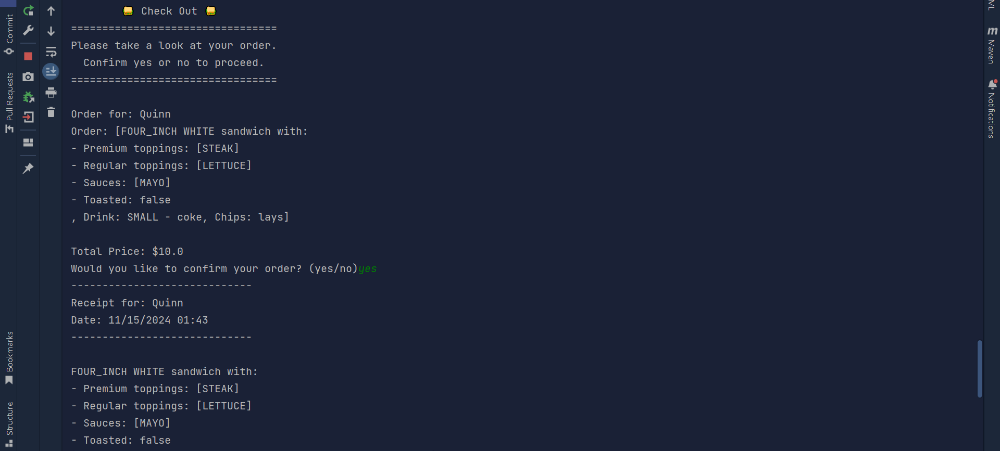

## Overview

The 704 Banh Mi Ordering System is a Java-based application designed to help users customize and order sandwiches with various options; including bread type, toppings, sauces, drinks, and chips. The system allows users to place orders under their name, view their order summary, and generate a receipt. It demonstrates key programming concepts such as user input handling, enum usage, object-oriented design, generic methods, interface classes, JUnit testing, etc..

## Features

- **Create New Order**: Start a new order by entering customer details.
- **Add Sandwich**: Choose bread type, sandwich size, regular and premium toppings, sauces, and toasting preference.
- **Add Drink**: Select drink size and choose your drink flavor.
- **Add Chips**: Choose your chip flavor.
- **Checkout**: Confirm order details, view total price, and generate receipt.
- **Save Receipt**: Automatically saves a receipt to a CSV file for future reference.
- **Order Summary**: Displays the complete order with all items added, including sandwiches, drinks, chips, and sauces.

## Structure

### The Big Picture 

The application is structured into several classes, each fulfilling a specific role:

### 1. `Sandwich`
This class represents a sandwich order and contains the following attributes:
- **bread**: Type of bread (e.g., White, Wheat, Rye).
- **size**: Size of the sandwich (e.g., 4-inch, 8-inch, 12-inch).
- **regularToppings**: List of regular toppings (e.g., Lettuce, Tomatoes, Pickles).
- **premiumToppings**: List of premium toppings (e.g., Steak, Chicken, Bacon).
- **sauces**: List of sauces (e.g., Mayo, Mustard, Homemade Butter).
- **toasted**: Boolean indicating whether the sandwich is toasted.

**Key Methods:**
- Getters and setters for each attribute.
- `toString()`: Returns a formatted string representation of the sandwich, useful for displaying order details.

### 2. `Order`
This class manages the entire order, including all items added by the customer (sandwiches, drinks, chips).

**Key Methods:**
- `addItem(Item item)`: Adds an item (sandwich, drink, chips) to the order.
- `getTotalPrice()`: Calculates and returns the total price of the order.
- `toString()`: Provides a detailed summary of the order, including all items and their prices.

### 3. `UtilMethods`
This class provides utility methods for interacting with the user, such as prompting for enum selections, string inputs, and validating choices.

**Key Methods:**
- `promptForEnum(Class<T> enumClass)`: Displays enum options and prompts the user to select one.
- `promptForEnumSelections(Class<T> enumClass)`: Prompts the user to select multiple enum values (e.g., toppings, sauces).
- `promptForChoice(int maxChoice)`: Prompts the user to make a selection from a list of options.
- `promptForYesNo(String message)`: Prompts the user with a yes/no question and returns the result.

### 4. `CheckoutScreen`
This class handles the final checkout process, displaying the order summary and confirming the order. It also saves the receipt to a CSV file and displays a thank-you message.

**Key Methods:**
- `displayCheckoutScreen(Order order)`: Displays the final order summary and handles user confirmation.
- `saveReceiptToCSV(Order order)`: Saves the order details to a CSV file for future reference.

### 5. `DrinkScreen`, `ChipsScreen`, and `SandwichScreen`
These classes handle user interactions for adding drinks, chips, and sandwiches to the order. They prompt the user for specific options (e.g., drink size, chips flavor, sandwich toppings) and update the order accordingly.

### 6. `HomeScreen` and `OrderScreen`
These classes handle the main user interface, displaying the home screen and the order menu, allowing users to start new orders, add items, or proceed to checkout.

## Menus

### Home Screen
The main menu allows users to start a new order or exit the application.

### Order Menu
From the order menu, users can add sandwiches, drinks, chips, and proceed to checkout.

### Checkout Screen
The checkout screen shows the order summary and prompts users to confirm the order.

## What Can Be Improved in the Deli Sandwich Ordering System?

- **User Input Validation**: Enhance validation to ensure that users only enter valid values (e.g., no negative numbers, invalid options).
- **Dynamic Pricing**: Implement a more dynamic pricing structure that adjusts based on factors like promotional discounts or loyalty programs.
- **Better Error Handling**: Provide more informative error messages for invalid inputs and edge cases.
- **Graphical User Interface (GUI)**: Consider building a GUI for a more user-friendly interface.
- **Better Usage of Enums**: Consider not hard-coding values into enum classes.

---

### My Favorite Part of the Code 💖

The part I found most interesting to work on was the `UtilMethods` class. By using generic methods for enum selection and user prompts, I was able to reduce repetition in my code and make it more maintainable.

---

### Final Thoughts

This project helped me gain a deeper understanding of Java and subjects such as advanced object-oriented programming or working with JUnit tests. If I'm being honest, this project was extremely difficult to complete as a beginner in Java. I contemplated quitting the program many times this week. But through the encouragement of my peers and my own grit, I'm still here. I'm excited about how well the application turned out and look forward to making it even better in the future.

